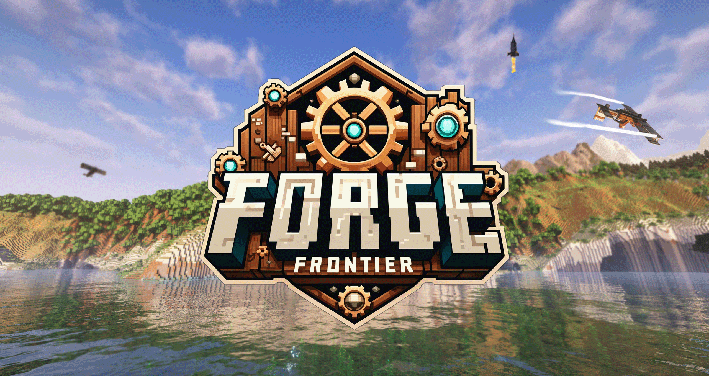

# Landscapes Reimagined Forge Frontier

## Description
Discover the pinnacle of Minecraft modding with **Landscapes Reimagined Forge Frontier**, 
a masterful sequel to the acclaimed [**Landscapes Reimagined Genesis**](https://modrinth.com/modpack/landscapes-reimagined-genesis). This edition, powered
by the NeoForged mod loader, delivers an unparalleled gaming experience, featuring sprawling
landscapes and intricate structures, courtesy of top-tier mods from YUNG and other notable
creators. Encounter a rich array of new mobs, delve into numerous quests, and explore custom
recipes. With cutting-edge additions like Framed Blocks, Sophisticated Backpacks, and 
Refined Storage,and many more, this modpack redefines storage and automation. Experience revamped world 
generation across all dimensions, immersing you in a world that honors the essence of Vanilla 
Minecraft, all while centering around the innovative Create mod and its many addons. Prepare for an adventure that 
captivates and elevates your Minecraft journey.

Download **Landscapes Reimagined Forge Frontier** today and dive into an elevated Minecraft adventure, striking a perfect balance between originality and innovation. The adventure awaits!
#### **Interested in joining our Patreon. Check out our benefits [here](https://discord.com/servers/landscapes-reimagined-1097668922737696919), then join our [Discord](https://discord.gg/quenZthXgy)**

### Want to setup a server using our official server host, click the banner below!

# Included Content
  

    
Mods

    <h3>Modrinth</h3>
    <ul>
      <li>
        <a href="https://discord.gg/quenZthXgy">Mod List will be provided on Discord, under the wiki section</a> - Check here for more information
      </li>
    </ul>
    <h3>Curseforge</h3>
      <li><a href="https://www.curseforge.com/minecraft/mc-mods/allthecompressed">AllTheCompressed</a></li>
      <li><a href="https://www.curseforge.com/minecraft/mc-mods/apotheosis">Apotheosis</a></li>
      <li><a href="https://www.curseforge.com/minecraft/mc-mods/apothic-attributes">Apothic Attributes (AttributesLib)</a></li>
      <li><a href="https://www.curseforge.com/minecraft/mc-mods/aquaculture">Aquaculture 2</a></li>
      <li><a href="https://www.curseforge.com/minecraft/mc-mods/chimes">Chimes</a></li>
      <li><a href="https://www.curseforge.com/minecraft/mc-mods/chisels-bits">Chisels and Bits</a></li>
      <li><a href="https://www.curseforge.com/minecraft/mc-mods/cosmetic-armor-reworked">Cosmetic Armor Reworked</a></li>
      <li><a href="https://www.curseforge.com/minecraft/mc-mods/crash-utilities">Crash Utilities</a></li>
      <li><a href="https://www.curseforge.com/minecraft/mc-mods/create-compressed">Create Compressed</a></li>
      <li><a href="https://www.curseforge.com/minecraft/mc-mods/create-confectionery">Create Confectionery</a></li>
      <li><a href="https://www.curseforge.com/minecraft/mc-mods/create-design-n-decor">Create Design n' Decord</a></li>
      <li><a href="https://www.curseforge.com/minecraft/mc-mods/create-wooderwheels">Create WooderWheels/a></li>
      <li><a href="https://www.curseforge.com/minecraft/mc-mods/dungeon-crawl">Dungeon Crawl</a></li>
      <li><a href="https://www.curseforge.com/minecraft/mc-mods/dynamic-view">Dynamic View[Forge]</a></li>
      <li><a href="https://www.curseforge.com/minecraft/mc-mods/eating-animation-forge">Eating Animation [Forge]</a></li>
      <li><a href="https://www.curseforge.com/minecraft/mc-mods/gml">GroovyModLoader (GML)</a></li>
      <li><a href="https://www.curseforge.com/minecraft/mc-mods/krypton-reforged">Krypton Reforged</a></li>
      <li><a href="https://www.curseforge.com/minecraft/mc-mods/kubejs-delight">KubeJS Delight</a></li>
      <li><a href="https://www.curseforge.com/minecraft/mc-mods/ore-excavation">Ore Excavation</a></li>
      <li><a href="https://www.curseforge.com/minecraft/mc-mods/placebo">Placebo</a></li>
      <li><a href="https://www.curseforge.com/minecraft/mc-mods/sophisticated-backpacks">Sophisticated Backpacks</a></li>
      <li><a href="https://www.curseforge.com/minecraft/mc-mods/sophisticated-core">Sophisticated Core</a></li>
      <li><a href="https://www.curseforge.com/minecraft/mc-mods/sophisticated-storage">Sophisticated Storage</a></li>
      <li><a href="https://www.curseforge.com/minecraft/mc-mods/time-in-a-bottle-forge">Time In A Bottle</a></li>
      <li><a href="https://www.curseforge.com/minecraft/mc-mods/time-in-a-bottle-curio-support">Time In A Bottle Curio Support</a></li>
      <li><a href="https://www.curseforge.com/minecraft/mc-mods/when-dungeons-arise">When Dungeons Arise</a></li>
      <li><a href="https://www.curseforge.com/minecraft/mc-mods/wither-skeleton-tweaks">Wither Skeleton Tweaks</a></li>
  

  
  

    
Datapacks

    <li><a href="https://modrinth.com/datapack/better-end-cities-(vanilla)">Better End Cities (Vanilla)</a></li>
    <li><a href="https://modrinth.com/datapack/create-renewable-ores">Create Renewable Ores</a></li>
    <li><a href="https://modrinth.com/datapack/edf-remastered">Ender Dragon Fight Remastered</a></li>
    <li><a href="https://discord.com/invite/D9cxayDNSP">End Remastered Yungs</a></li>
    <li><a href="https://modrinth.com/datapack/remove-terralith-intro-message">Remove Terralith Intro Message</a></li>
    <li><a href="https://modrinth.com/datapack/disable-ad-astra-oil-wells">Remove Oil Well</a></li>
    <li><a href="https://modrinth.com/datapack/repurposed-structures-better-desert-temples-compat">Repurposed Structures - Better Desert Temples Compat</a></li>
    <li><a href="https://modrinth.com/datapack/repurposed-structures-better-dungeons-compat">Repurposed Structures - Better Dungeons Compat</a></li>
    <li><a href="https://modrinth.com/datapack/repurposed-structures-better-jungle-temples">Repurposed Structures - Better Jungle Temples Compat</a></li>
    <li><a href="https://modrinth.com/datapack/repurposed-structures-better-ocean-monuments-compat">Repurposed Structures - Better Ocean Monuments Compat</a></li>
    <li><a href="https://modrinth.com/datapack/repurposed-structures-better-nether-fortress-compat">Repurposed Structures - Better Nether Fortress Compat</a></li>
    <li><a href="https://modrinth.com/datapack/repurposed-structures-better-strongholds-compat">Repurposed Structures - Better Strongholds Compat</a></li>
    <li><a href="https://modrinth.com/datapack/repurposed-structures-better-witch-huts-compat">Repurposed Structures - Better Witch Huts Compat</a></li>
    <li><a href="https://modrinth.com/datapack/repurposed-structures-bountiful-compat">Repurposed Structures - Bountiful Compat</a></li>
    <li><a href="https://modrinth.com/datapack/repurposed-structures-farmers-delight-compat">Repurposed Structures - Farmer's Delight Compat</a></li>
    <li><a href="https://modrinth.com/datapack/repurposed-structures-friends-and-foes-compat">Repurposed Structures - Friends and Foes Compat</a></li>
    <li><a href="https://modrinth.com/datapack/repurposed-structures-villagerplus-compat">Repurposed Structures - VillagerPlus Compat</a></li>
    <li><a href="https://modrinth.com/datapack/gm4-shapeless-portals">Shapeless Portals</a></li>
    <li><a href="https://modrinth.com/datapack/the-ancient-city-overhaul">The Ancient City Overhaul</a></li>
    <li><a href="https://modrinth.com/datapack/the-bastion-overhaul">The Bastion Overhaul</a></li>
    <li><a href="https://modrinth.com/datapack/the-trail-ruins-overhaul">The Trail Ruins Overhaul</a></li>
  

  
  

    
Resource Packs

    <li><a href="https://www.curseforge.com/minecraft/texture-packs/create-immersive-aircrafts-resource-pack">Create Immersive Aircrafts</a></li>
    <li><a href="https://www.curseforge.com/minecraft/texture-packs/lootrchestretexture-for-create">LootrChestRetexture for Create!</a></li>
    <li><a href="https://www.curseforge.com/minecraft/texture-packs/copycat-framed-blocks">Copycat Framed Blocks</a></li>
    <li><a href="https://discord.com/invite/D9cxayDNSP">End Remastered Ideal</a></li>
    <li><a href="https://modrinth.com/resourcepack/sparkles">Stardust Labs Resourcepack</a></li>
    <li><a href="https://modrinth.com/resourcepack/sparkles-addon-alpha-islands">Sparkles ADDON: Alpha Islands</a></li>
    <li><a href="https://modrinth.com/resourcepack/fresh-animations">Fresh Animations</a></li>
    <li><a href="https://www.curseforge.com/minecraft/texture-packs/create-style-construction-wands">Lopy's Create Style Construction Wands (Requires External Download upon world load)</a></li>
    <li><a href="https://www.curseforge.com/minecraft/texture-packs/create-pipez">Lopy's Create Style Pipez (Requires External Download upon world load)</a></li>
    
  

  
  

    
Shaders

    <ul>
      <li>
        <a href="https://modrinth.com/shader/complementary-reimagined">Complementary Reimagined</a>
      </li>
      <li>
        <a href="https://modrinth.com/shader/complementary-unbound">Complementary Reimagined Unbound</a>
      </li>
    </ul>
  
 

    
Quests (Spoiler)

  

    
 Main Chapter 

    
  

  
  

    
 QOL Tools Chapter 

    
  

  

    
 Decoration Mods Chapter 

    
  

  

    
 Overworld Chapter 

    
  

  

    
 The Nether Chapter 

    
  

  

    
 End Remastered Chapter 

    
  

  

    
 The End Chapter 

    
  

  

    
 Ad Astra Chapter 

    
  

  

    
 Deeper and Darker Chapter 

    
  

  

    
 Create Chapter 

    
  

  

    
 Create Addons pg 1 Chapter 

    
  

  

    
 Create Addons pg 2 Chapter 

    
  

  

    
 Create Addons pg 3 Chapter 

    
  

  

    
 Molten Ores Chapter 

    
  

  

    
 Boss Mobs Chapter 

    
  

  

    
 Better Storage Chapter 

    
  

  

    
 Sophisticated Mods Chapter 

    
  

  

    
 Refined Storage Chapter 

    
  

  

    
 Easy Automations Chapter 

    
  

  

    
 Food Chapter 

    
  

  

    
 Artifacts and Baubley Chapter 

    
  

  

    
 Apotheosis Chapter 

    
  

  

    
 Transportation Chapter 

    
  

  

    
 Creative Items Chapter 

    
  

  

